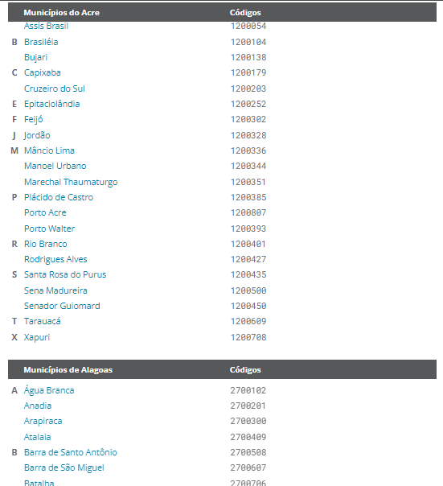

# IBGE data extract

Extract municipal data by <a href="https://www.ibge.gov.br/explica/codigos-dos-municipios.php" target="_blank"> `IBGE` </a> city list.

## How it works

This script is a web scraping code, its use all citys url in <a href="https://www.ibge.gov.br/explica/codigos-dos-municipios.php" target="_blank"> `IBGE` </a> site:

    

And uses all url to scrap info for the citys:

    <h3>Data table:</h3>
    <table align="center">
        <tr>
            <th>Nome</th>
            <th>Código</th>
            <th>Área territorial</th>
            <th>População residente</th>
            <th>Densidade demográfica</th>
            <th>Escolarização de 6 a 14 anos</th>
            <th>IDHM índice de desenvolvimento humano municipal</th>
            <th>Mortalidade infantil</th>
            <th>Receitas realizadas</th>
            <th>Despezas empenhadas</th>
            <th>PIB per capita</th>
        </tr>
        <tr>
            <th>The city name</th>
            <th>The IBGE city code</th>
            <th>Territorial area (km²)</th>
            <th>Total population</th>
            <th>Demographic density (pop/km²)</th>
            <th>Schooling from ages 6 to 14 (%)</th>
            <th>Municipal HDI</th>
            <th>Deaths per 1000 births</th>
            <th>Revenue realized ($)</th>
            <th>Expenses incurred ($)</th>
            <th>GDP per capita (total GDP/pop)</th>
        </tr>
    </table>

## Warning
The script may take a while to run, there are over 5500 cities in Brazil, so it will depend on your internet connection and the speed of your hardware.
Depending on the modifications in the code, there is a risk of an `requests.exceptions.ConnectTimeout` error, but in the `src/utils/get_response.py` path this has been solved with a recursion.

## Usage

1. Clone the repository
2. Install the dependencies: Use the `pip install -r requirements.txt`
3. Run `app.py`

## Contact-me

    
    
    

